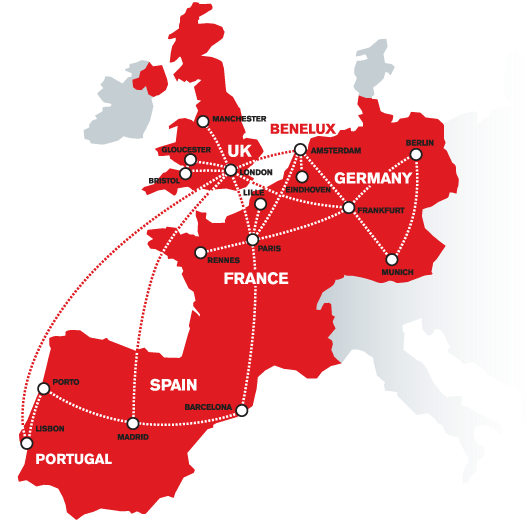

# AdvNet 2021 - Project

As announced at the beginning of the course, a group project will take place during second part of the semester. Quick reminder, this project counts for 40% of your final grade.

It's time that you get to know a bit more about it 🙂

---
<!-- TOC -->

- [Overview](#overview)
- [Timeline](#timeline)
- [Group registration](#group-registration)
- [Daily testing and leaderboard](#daily-testing-and-leaderboard)

<!-- /TOC -->

---

## Overview

The AdvNet 2021 project is organized as a competition where students (in groups of 3) have full freedom to program and configure a network to perform best. The network topology is that of a real AS (the [Claranet network](https://noc.eu.clara.net/), shown below) where we consider all nodes to be P4-programmable switches. Some links have different delays and bandwidth capacity, which will be detailed in due time.

|  |
|:--:|
| *The [Claranet network](https://noc.eu.clara.net/); this is the network topology you will program in this year's project.* |

Network performance is measured as its ability to meet a number of service-level agreements (SLAs). These may relate to include:

- Packet loss rate,
- Flow completion time,
- Way-pointing,
- Fast-rerouting. 

Each group will be evaluated over the same set of 1-min scenarios over the same SLAs, which will be known ahead of time. Some network traffic is generated according to a configuration, also known ahead of time; this is referred to as the _base traffic_.

In addition to the switches' program, each group submits three configurations:

1. Three _additional links_, that are added to their own network topology (and can of course be used to transport traffic);
2. Some _additional traffic_, defined as a fixed number of UDP packets to be sent between chosen hosts at a chosen rate;
3. A failure scenario, which defines a set of links that become temporarily unavailable; the configurations specifies which links, when they fail, and for how long.

Ultimately, all groups will be assessed on the same set of scenarios, which includes

- The group's additional links (i.e., each group uses its own link configuration);
- The base traffic;
- One additional traffic, picked randomly among all the groups' configuration;
- One failure scenario, picked randomly among all the groups' configuration.

The groups will be ranked based on the number of SLAs their network successfully meet. There will be some weighting between the SLAs; the ranking scheme will be known in advance.

> 🚨 **Important** 🚨  
>  
> The group ranking in the competition is _not_ taken into account in the final project grade. The project will be graded based on:
>
> - The interest of the solution;
> - The quality of the code;
> - The quality of the final presentations.
>
> More details will follow in due time.

## Timeline

The project will start on week 7; that is, you will then have access to new VMs for the project, and will be able to start programming your network.
The different SLAs and project features (additional links, additional traffic, failure scenarios) and SLA to fulfill will be made available progressively.

The most important dates are summarized below:

- Week 7, Tue **(tentative)**. Project starts - VMs are available
- Week 9, Tue **(tentative)**. All features available, and SLAs disclosed
- Week 10, Sun. Groups submit their traffic and failure configurations
- Week 13, Fri. Groups submit their link configuration and switch programs
- Week 14, Mon. Poster deadline
- Week 14, Tue. Final presentation, disclosure of the competition results

> The last exercise will take place on week 8. For the remaining weeks, the exercise sessions will be used as "project time" where teaching assistants will be available for technical support.

## Group registration

The project is done in groups of three students (freely composed).  
Please **register your groups by next Tuesday (Oct 26)!**

👉 &nbsp; [Group registration link](https://adv-net.ethz.ch/registration/)

## Daily testing and leaderboard

Soon after the project start, we will test your progress once per day and publish on the project website. This will allow:

- Us to monitor your progress, and 
- You to know how you (currently) fare compared to the other groups.

Naturally, you will be able to test your own network as much as you own in your own VMs. Details will be provided when the project starts. 